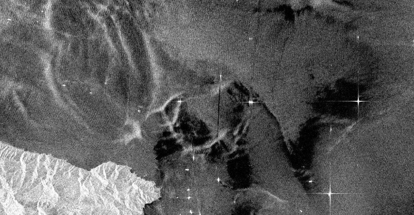
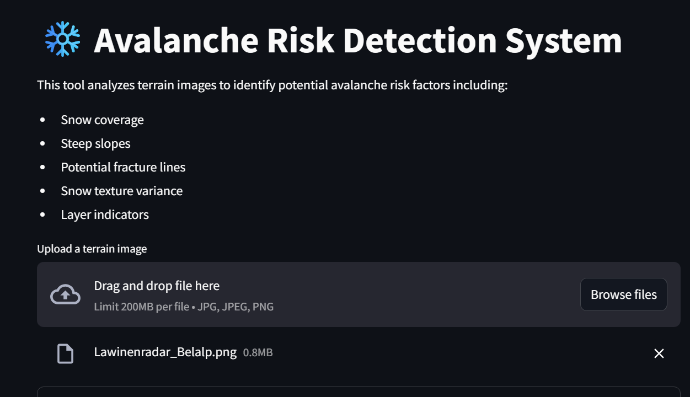
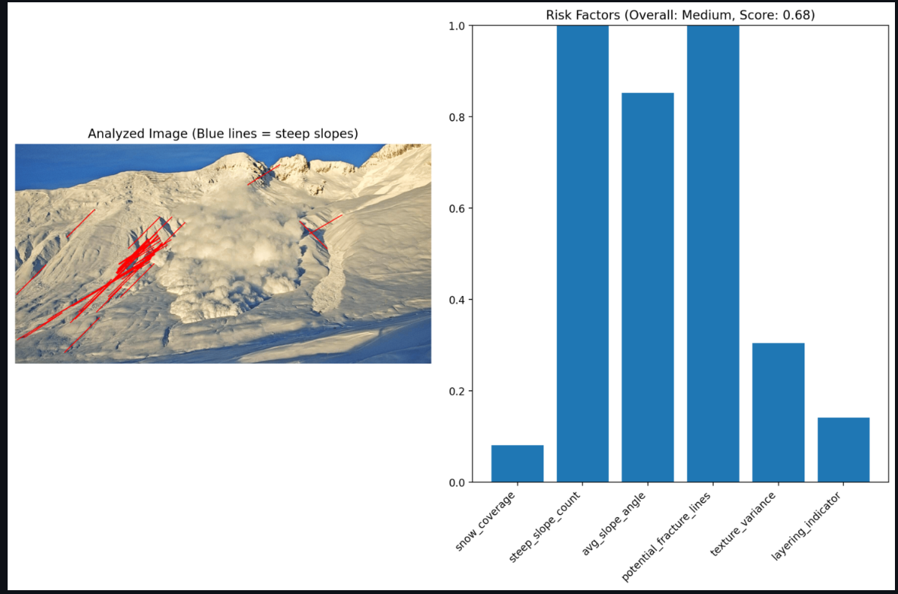
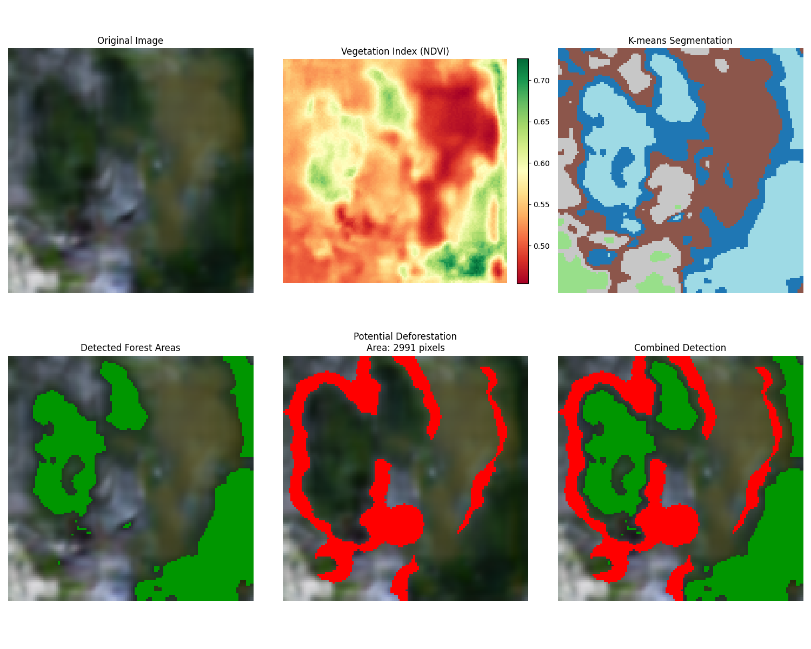

# 🌍 Chryse.AI

**Chryse.AI** is a Python-based toolkit designed for landscape delineation using multispectral and Synthetic Aperture Radar (SAR) imagery. It offers functionalities for:

- 🌈 Colorizing SAR images  
- 🌳 Deforestation detection  
- 🏔️ Avalanche delineation through an interactive Streamlit interface  

## ⚙️ Installation

### Clone the Repository


---

## ⚙️ Installation

### Clone the Repository

```bash
git clone https://github.com/Svastik73/Chryse.AI.git
cd Chryse.AI


<h2>SAR image colorization</h2>
<p align="center">
  
  
</p>


<h2>Avalanche dilineation</H2>
<p align="center">
  
  
</p>
<h2>Geographic loss </h2>


